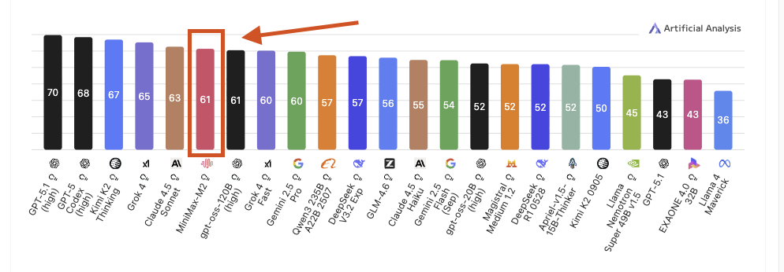
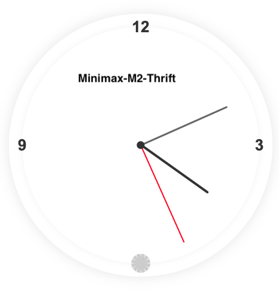
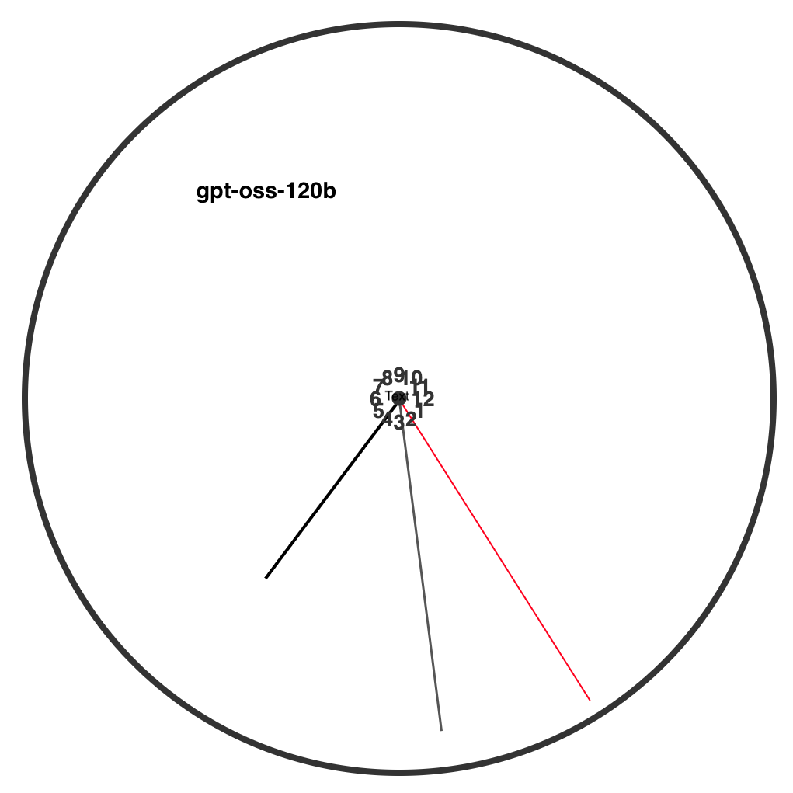

# I Replaced My $200/Month GPT-4 Subscription with a Local AI Agent

*How to deploy state-of-the-art AI agents on Mac Studio, DGX Spark, and AMD AI Max hardware — completely free and private.*

---



*MiniMax M2 ranks among the top open-source models globally*

---

With 128GB of RAM becoming standard in high-end consumer machines, you can now run state-of-the-art AI agents entirely locally. This guide shows you how to deploy MiniMax M2-THRIFT with Mini-Agent — achieving near-GPT-4 performance without cloud APIs, subscription fees, or privacy concerns.

## Why This Matters

Most AI agent frameworks force you to choose between:

- **Expensive cloud APIs** — $10-75 per million tokens adds up fast
- **Inconsistent local models** — struggle with complex tasks and tool use
- **Privacy trade-offs** — your code and data sent to third parties

MiniMax M2-THRIFT + Mini-Agent solves all three problems.

## Who This Guide Is For

If you own any of these machines with 128GB RAM:

- Apple Mac Studio M2/M3 Ultra
- NVIDIA DGX Spark
- AMD AI Max 395 Mini PC

You can run a fully capable AI coding agent locally that rivals commercial APIs.

---

## Understanding MiniMax M2-THRIFT

### The Base Model

MiniMax M2 is a Mixture-of-Experts (MoE) model released in October 2025:

**Architecture:**
- 230 billion total parameters
- Only 10 billion active per token
- 128K token context window
- MIT license (fully open)

**Performance:**
- Ranks #1 among open-source models on Artificial Analysis Intelligence Index
- 67% coding score, 61% overall intelligence
- Specifically optimized for agentic workflows
- Comparable to GPT-4 and Claude Sonnet on practical tasks

### What Makes THRIFT Special

THRIFT applies expert pruning to reduce the model by ~25%:

**Benefits:**
- Faster CPU inference
- Lower memory: ~70GB vs ~90GB
- 95% of full model quality

**Benchmarks:**
- Math: +0.53% vs full
- Coding: +1.10% vs full
- Knowledge: -4-5% vs full

### REAP Variants

Even more efficient options:

**REAP-172B:** 65GB RAM, 2% performance loss
**REAP-162B:** 60GB RAM, 5% performance loss

---

## Hardware Requirements

**RAM: 128GB minimum**
- Model: ~70GB
- System: ~10GB
- Headroom: ~48GB

**Storage: 100GB free**

**CPU: 8+ cores** (Apple Silicon recommended)

---

## Installation

### Step 1: Install LM Studio

Download from [lmstudio.ai](https://lmstudio.ai)

### Step 2: Download Model

In LM Studio:
1. Search: `MiniMax-M2-THRIFT-i1`
2. Select: **IQ4_XS** quantization
3. Download

**If split into parts:**

```bash
cd ~/.lmstudio/models/mradermacher/MiniMax-M2-THRIFT-i1-GGUF/
cat MiniMax-M2-THRIFT.i1-IQ4_XS.gguf.part1of2 \
    MiniMax-M2-THRIFT.i1-IQ4_XS.gguf.part2of2 \
    > MiniMax-M2-THRIFT.i1-IQ4_XS.gguf
rm *.part*
```

### Step 3: Start Server

1. Load model in LM Studio
2. Start Local Server (port 1234)
3. Verify: `http://localhost:1234/v1/models`

### Step 4: Install Mini-Agent

```bash
cd ~/Documents
git clone https://github.com/MiniMax-AI/Mini-Agent.git
cd Mini-Agent
pip install -e .
```

### Step 5: Configure

```bash
mkdir -p ~/.mini-agent/config
```

Create `~/.mini-agent/config/config.yaml`:

```yaml
api_key: "not-needed"
api_base: "http://localhost:1234"
model: "minimax-m2-thrift-i1"
provider: "openai"

retry:
  enabled: true
  max_retries: 3
  initial_delay: 1.0

max_steps: 100
workspace_dir: "./workspace"
system_prompt_path: "system_prompt.md"

tools:
  enable_file_tools: true
  enable_bash: true
  enable_note: true
  enable_skills: true
  skills_dir: "./skills"
```

Copy system prompt:

```bash
cp ~/Documents/Mini-Agent/mini_agent/config/system_prompt.md ~/.mini-agent/config/
```

---

## Usage

```bash
cd ~/my-project
mini-agent
```

### Example: Code Generation

```
Create a Python script for CSV analysis with visualizations
```

The agent will:
1. Create script structure
2. Import libraries
3. Write data loading
4. Add statistical analysis
5. Generate visualizations

### Example: Refactoring

```
Refactor to async/await with error handling
```

The agent will:
1. Read all files
2. Identify blocking code
3. Convert to async
4. Add error handling
5. Update call sites

---

## Cost Analysis

**GPT-4 API:** $10/M tokens, no privacy
**Claude Sonnet:** $15/M tokens, no privacy
**MiniMax Local:** $0/M tokens, full privacy

**Break-even:** 3-6 months for heavy users (10M+ tokens/month)

---

## Real-World Test: Analog Clock

**Task:** Generate working HTML/CSS/JS analog clock

**MiniMax M2-THRIFT:** ✓ Working on first try



**GPT-OSS-120B:** Required 3 iterations



**Qwen3-Coder:** Too large for 128GB

---

## Troubleshooting

**Model not found:**
```bash
curl http://localhost:1234/v1/models
```

**Out of memory:**
Try IQ3_XXS quantization or REAP-162B variant

**Slow inference:**
- Close background apps
- Check CPU cooling
- Ensure model fully loaded

---

## Alternative: Codex + GPT-OSS

MiniMax M2 had consistency issues with Codex's `apply_patch` tool.

For Codex users, try GPT-OSS-120B instead:

```toml
[model_providers.lms]
base_url = "http://localhost:1234/v1"

[profiles.gpt-oss-120b-lms]
model_provider = "lms"
model = "openai/gpt-oss-120b"
```

---

## When to Use Local vs Cloud

**Use Local:**
- Privacy-sensitive work
- 10M+ tokens/month
- Offline requirements
- Unlimited experimentation

**Use Cloud:**
- Multi-modal tasks
- Occasional use (<1M tokens/month)
- Latest capabilities

---

## Conclusion

MiniMax M2-THRIFT on 128GB machines offers:

- Near-GPT-4 performance
- Complete privacy
- Zero ongoing costs
- Offline functionality

**Investment:** Mac Studio ($3,999) or alternatives
**Setup time:** ~2 hours
**Break-even:** 3-6 months for heavy users

### Next Steps

1. Download THRIFT with IQ4_XS
2. Install Mini-Agent
3. Test with simple tasks
4. Explore REAP variants if needed

The future of AI development isn't exclusively cloud-based.

---

**Resources:**
- [LM Studio](https://lmstudio.ai)
- [Mini-Agent](https://github.com/MiniMax-AI/Mini-Agent)
- [THRIFT Model](https://huggingface.co/VibeStudio/MiniMax-M2-THRIFT)
- [r/LocalLLaMA](https://reddit.com/r/LocalLLaMA)

---

*By Lino Valdovinos | January 2025 | Mac Studio M2 Ultra*
